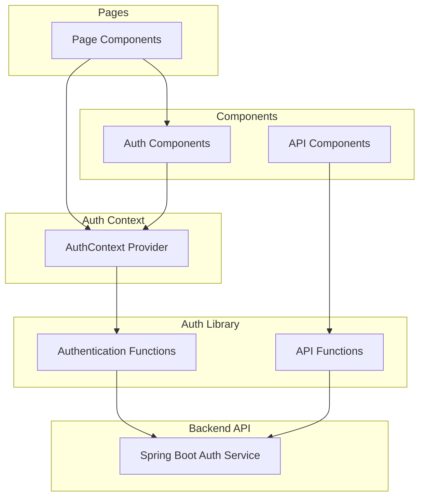
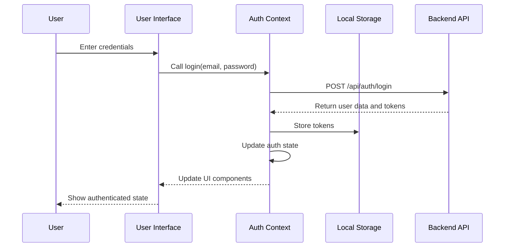
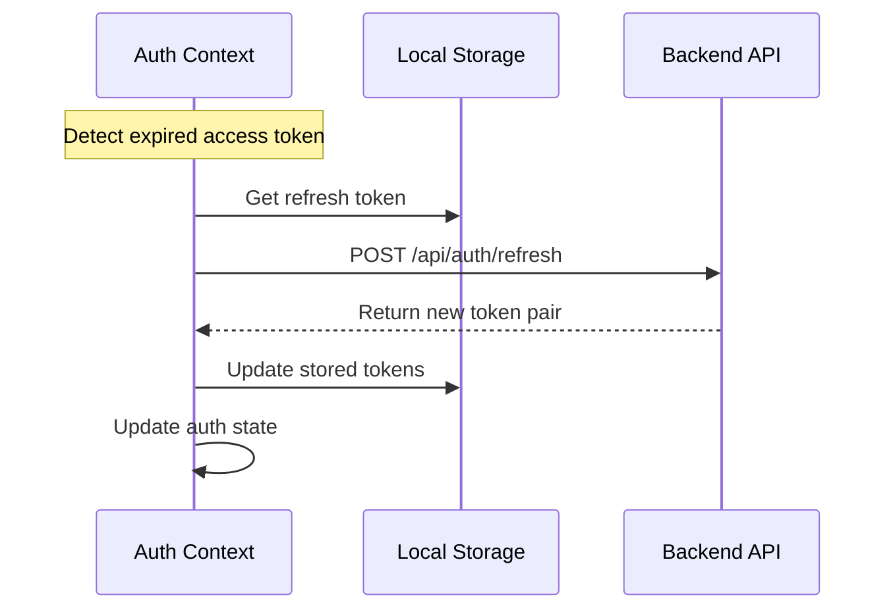
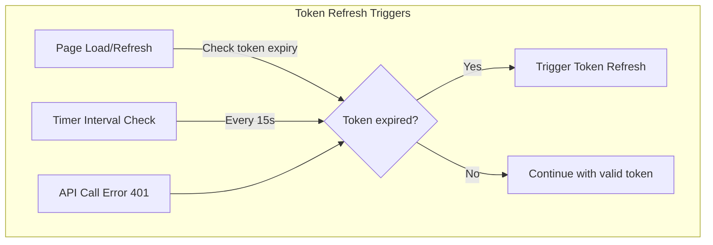
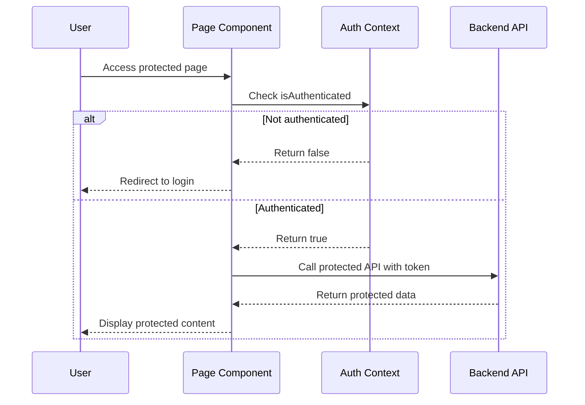
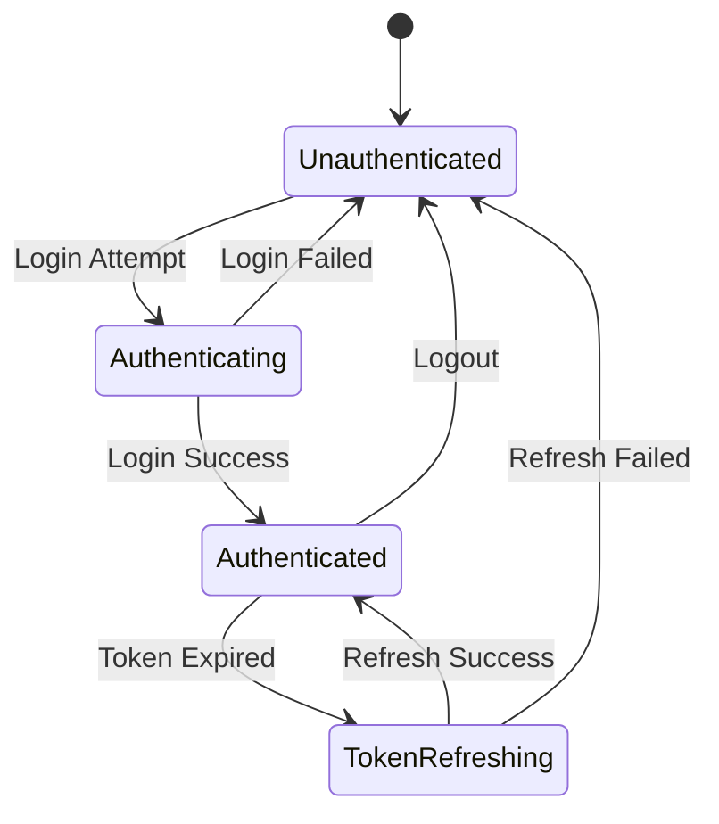

# Next.js JWT Authentication Client

This client application demonstrates JWT authentication implementation in a Next.js React application. It provides a complete authentication flow including login, automatic token refresh, protected routes, and logout functionality.

## Architecture Overview



## Project Structure

```
auth-service-client/
├── app/
│   ├── api/
│   │   └── ...               # API route handlers (if needed)
│   ├── components/
│   │   ├── auth/
│   │   │   ├── AuthButtons.tsx    # Login/Logout buttons
│   │   │   ├── AuthContext.tsx    # Authentication context provider
│   │   │   └── ...
│   │   └── ...
│   ├── lib/
│   │   ├── apiTest.ts        # Functions for testing API endpoints
│   │   └── auth.ts           # Authentication utility functions
│   ├── types/
│   │   └── auth.ts           # TypeScript definitions for auth
│   ├── globals.scss          # Global styles
│   ├── layout.tsx            # Root layout component
│   ├── page.module.scss      # Page-specific styles
│   └── page.tsx              # Main page component
├── public/
│   └── ...                   # Static assets
├── next.config.js            # Next.js configuration
├── package.json              # Project dependencies
└── ...
```

## Authentication Flow

### Login Process



### Token Refresh Process



### Automatic Token Refresh Triggers



### Protected Route Access



## Key Components

### AuthContext.tsx

The central authentication management component that:
- Provides authentication state to the entire application
- Manages tokens in localStorage
- Handles login, logout and token refresh
- Automatically refreshes tokens when needed
- Exposes authentication state and functions to other components

```typescript
// Simplified example
const AuthContext = createContext<AuthContextType>({
  user: null,
  isAuthenticated: false,
  loading: true,
  login: async () => {},
  logout: () => {},
  tokens: null,
  setTokens: () => {}
});

export function AuthProvider({ children }) {
  const [user, setUser] = useState(null);
  const [tokens, setTokens] = useState(null);
  
  // Authentication methods...
  
  // Load auth state from storage
  useEffect(() => {
    // Implementation...
  }, []);
  
  // Token refresh timer
  useEffect(() => {
    // Implementation...
  }, [tokens]);
  
  return (
    <AuthContext.Provider value={{ user, isAuthenticated: !!user, ... }}>
      {children}
    </AuthContext.Provider>
  );
}
```

### auth.ts Library

Handles all API communication with the authentication backend:

```typescript
// Key functions in auth.ts:

// Decode JWT payload
export const decodeJwt = (token: string): JwtPayload => {
  // Implementation...
};

// Login API call
export const loginTest = async (credentials: LoginCredentials): Promise<AuthResponse> => {
  // Implementation...
};

// Token refresh API call
export const refreshTestToken = async (refreshToken: string): Promise<AuthTokens> => {
  // Implementation...
};

// Logout API call
export const logoutTest = async (accessToken: string, userId: string): Promise<void> => {
  // Implementation...
};

// Calculate remaining time for token
export const getRemainingTime = (token: string): number => {
  // Implementation...
};
```

## User Authentication States



## Token Management

### Token Storage

Tokens are stored in browser's localStorage:

```typescript
// Storage keys
const ACCESS_TOKEN_KEY = 'access_token';
const REFRESH_TOKEN_KEY = 'refresh_token';
const USER_KEY = 'auth_user';

// Store tokens
localStorage.setItem(ACCESS_TOKEN_KEY, accessToken);
localStorage.setItem(REFRESH_TOKEN_KEY, refreshToken);
localStorage.setItem(USER_KEY, JSON.stringify(userData));

// Retrieve tokens
const accessToken = localStorage.getItem(ACCESS_TOKEN_KEY);
const refreshToken = localStorage.getItem(REFRESH_TOKEN_KEY);
```

### Token Refresh Logic

The client automatically refreshes tokens in several ways:

1. **Periodic checking**: Every 15 seconds, the system checks if the access token will expire within 10 seconds
   ```typescript
   const TOKEN_REFRESH_INTERVAL = 15 * 1000;  // 15 seconds
   const TOKEN_REFRESH_THRESHOLD = 10;        // 10 seconds threshold
   ```

2. **Page load/refresh**: On page load, checks if access token is expired but refresh token is valid

3. **Failed API calls**: If an API call returns 401, attempts token refresh before retrying

## API Access Implementation

Protected API calls are made using the access token from the auth context:

```typescript
// Example of using access token for API calls
const callProtectedApi = async () => {
  const { tokens } = useAuth();
  
  if (!tokens?.accessToken) {
    return { error: 'Not authenticated' };
  }
  
  try {
    const response = await fetch('http://localhost:8080/api/protected', {
      headers: {
        'Authorization': `Bearer ${tokens.accessToken}`
      }
    });
    
    if (response.status === 401) {
      // Token expired, handle refresh
    }
    
    return await response.json();
  } catch (error) {
    // Error handling
  }
};
```

## Type Definitions

Key TypeScript interfaces used in the authentication system:

```typescript
// Auth types
export interface User {
  id: string;
  email: string;
  name: string;
  role: string;
}

export interface AuthTokens {
  accessToken: string;
  refreshToken: string;
}

export interface AuthResponse {
  user: User;
  tokens: AuthTokens;
}

export interface LoginCredentials {
  email: string;
  password: string;
}

export interface JwtPayload {
  sub: string;
  email?: string;
  name?: string;
  role?: string;
  iat: number;
  exp: number;
}
```

## How to Run

### Prerequisites

- Node.js 16.8+ (Next.js requirement)
- npm or yarn
- Backend service running (see backend README)

### Installation

1. Install dependencies:
   ```bash
   npm install
   # or
   yarn install
   ```

2. Run the development server:
   ```bash
   npm run dev
   # or
   yarn dev
   ```

3. Open [http://localhost:3000](http://localhost:3000) in your browser.

## Usage

### Login

Use the test credentials to log in:
- Email: test@example.com
- Password: password

### Testing Protected Routes

After logging in, you can:
1. Access the protected API endpoint
2. View your user profile
3. Test the admin-only route (requires admin role)

### Testing Token Refresh

1. Login to get an initial token
2. The access token will automatically refresh in the background
3. You can observe token refresh behavior in the browser console

## Security Considerations

For a production application, consider:

1. **XSS Protection**: Consider using httpOnly cookies for token storage when possible
2. **Token Security**: Validate tokens and their expiration on the client side
3. **Error Handling**: Implement clear error messages for authentication failures
4. **Session Management**: Add idle timeout for inactive users
5. **Secure Routes**: Ensure all protected routes check authentication state
6. **Secure API Calls**: Add timeout and retry logic for API calls 